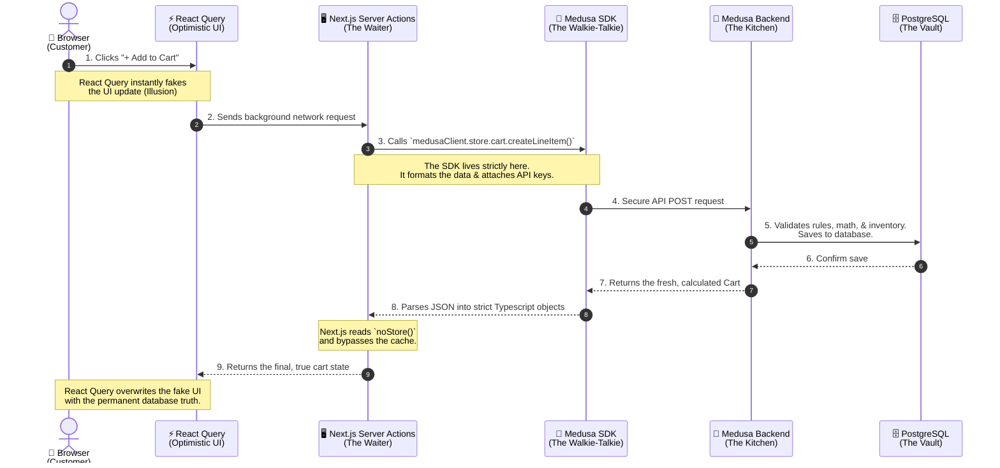

# E-Commerce Cart Architecture

Here is the precise architectural flowchart showing exactly how data moves from the user's click down to the database, and specifically where the **Medusa SDK** fits in.

### Key Takeaways
1. **React Query** only exists on the far left (in the browser) to make things look fast.
2. **The Medusa SDK** only exists in the middle (on the Next.js server) to ensure we talk to the backend perfectly.
3. **Medusa** sits on the far right, holding the absolute truth.
