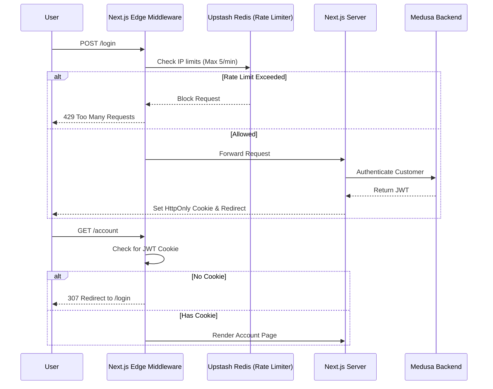
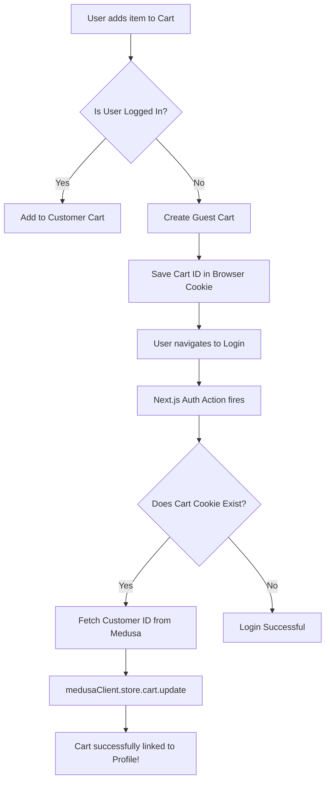
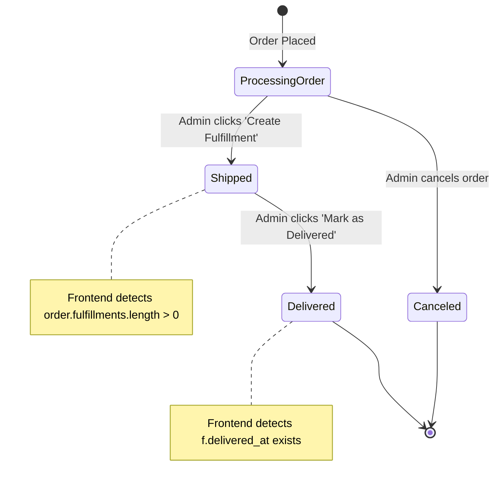
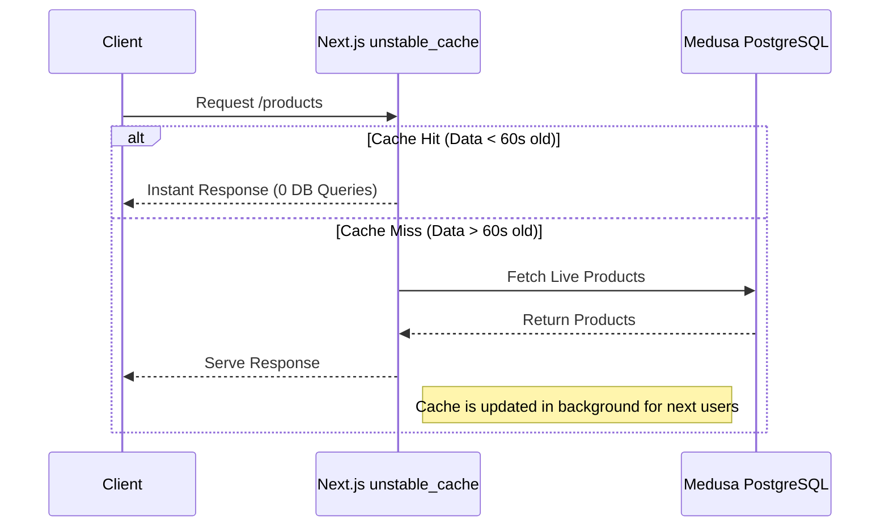

# LaundryMall - System Logic & Flowcharts

Below are the architectural flowcharts detailing the complex logic implemented in the LaundryMall platform.

## 1. Edge Security & Authentication Flow
This flowchart demonstrates how the Edge Middleware protects the application from bots and unauthenticated users before they even reach the server.

## 2. Cart Auto-Healing & Customer Linking
This illustrates the complex logic used to track guest carts and safely merge them into customer profiles without crashing the Medusa validation engine.

## 3. Order Status Tracking Logic
This diagram explains how the frontend parses Medusa v2's complex fulfillment arrays to generate a clean, user-friendly 3-step progress bar.

## 4. High-Performance Caching Strategy
How we prevent the database from crashing during high-traffic spikes using Incremental Static Regeneration (ISR).

