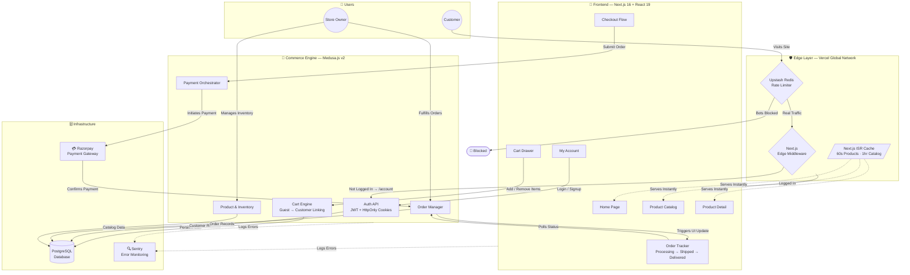

# LaundryMall - Platform Overview (For Business Owners)

This document explains the custom engineering behind LaundryMall. Instead of using a basic website builder (like Wix or standard Shopify), this platform was custom-built using the same technology that powers massive tech companies. Here is a breakdown of what we built and why it matters to your business.

## How Everything is Connected (The Big Picture)
Here is a simple map of how the different pieces of your new platform work together to protect your business and serve your customers:

## 1. The "Two-Brain" System (Headless Architecture)
Normally, a website's design and its database are mixed together. If the database gets slow, the whole website crashes. 
* **What we did:** We split LaundryMall into two separate "brains." The front end (what the customer clicks) runs independently from the back end (where your orders and data live).
* **Business Value:** Your store will load lightning fast for customers, and even if your admin dashboard is processing thousands of orders, the storefront will never slow down or crash.

## 2. The Smart Memory (Caching System)
If 1,000 customers visit your site at the exact same time, a normal website will ask the database for the price of a product 1,000 times, causing the server to crash.
* **What we did:** We built a "Smart Memory" system. The website takes a snapshot of your catalog and memorizes it. It only checks the database for updates every 60 seconds.
* **Business Value:** Zero server crashes during big sales or traffic spikes. It also keeps your server hosting costs incredibly low because the database isn't working overtime.

## 3. The Bouncer (Edge Security & Anti-Hacking)
We don't want bots spamming your website, attempting to guess customer passwords, or trying to bring the site down.
* **What we did:** We built an "Edge Security Shield" that sits *outside* your website. If an IP address tries to guess a password too many times in 10 seconds, this shield instantly blocks them before they even reach your actual server.
* **Business Value:** Enterprise-grade security. Your customers' data is safe, and your server won't get overwhelmed by malicious bot traffic.

## 4. The "Magic" Shopping Cart
A common issue in e-commerce is when a customer adds 5 items to their cart *before* logging in. When they finally log in or create an account, their cart empties out, causing them to abandon the purchase.
* **What we did:** We wrote custom logic that secretly remembers the guest's cart. The moment they log in or sign up, the system automatically merges their anonymous cart into their new customer profile.
* **Business Value:** Higher conversion rates and zero lost sales from frustrated customers.

## 5. The Live Order Tracker
Customers hate wondering where their order is, which leads to them calling or emailing your support line constantly.
* **What we did:** We built a custom dashboard for the customer. When you (the owner) click "Create Fulfillment" or "Mark as Delivered" in your private admin panel, the customer's dashboard instantly updates a visual 3-step progress bar (Processing -> Shipped -> Delivered).
* **Business Value:** Less customer support emails, and a highly professional, Amazon-like experience for the buyer.
